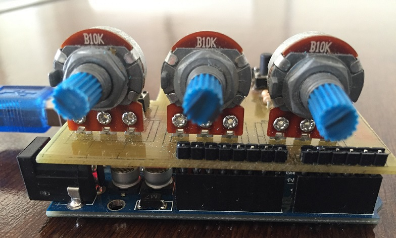
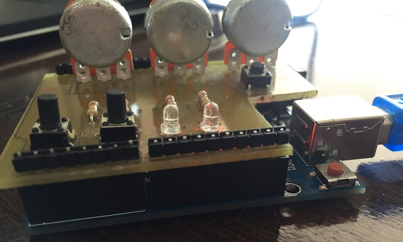

# Estacion Meteorológica
Proyecto con **Arduino UNO** para Estacion Meteorológica.

El propósito de este Trabajo es desarrollar un sitio web que monitoree el estado de una estación meteorológica equipada con tres sensores. Los sensores miden temperatura (LM35), velocidad del viento (107U) y humedad (HIH4000).

Además la estación cuenta con dos sensores digitales, uno de apertura del gabinete y otro de corte de suministro eléctrico provisto por una celda de energía solar.

Los sensores de temperatura, humedad y viento son simulados con potenciómetros en entradas analógicas.





El sitio web debe permitir dos niveles de seguridad. Uno de administrador y otro de usuario. El administrador puede configurar cantidad de sensores conectados, transferencias de los mismos, tiempo entre muestras, umbrales de alarma desde entradas analógicas o digitales y transmisión de novedades por correo electrónico. El usuario debe poder observar el estado actual de los sensores y registros diarios y por bandas horarias. 

El sistema deberá notificar por correo electrónico si:

- La transmisión de datos se interrumpe por más de cinco muestras.
- Se abre el gabinete.
- Se interrumpe la energía provista por la celda solar.


### Requisitos de entorno

- NodeJS (v8.9.0)
- MongoDB (v3.4.0)
- Arduino IDE

### Setup
Instalar las dependencias de NodeJS:

```
cd app
npm install
```

Con Arduino IDE, ejecutar el bootloader del archivo `firmware/ArduinoNodeJS/ArduinoNodeJS.ino`

### Variables de entorno
Generar un archivo `.env` en `/app` con las siguientes variables:

```
EMAIL=email_de_Gmail_para_nodemailer
EMAIL_PSSWD=password
```

### Ejecutar
1. Conectar la placa Arduino UNO a un puerto USB de la computadora.
2. Arancar el servidor de MongoDB (MongoDB Database Server)
3. Ejecutar la aplicación de Node:
```
cd app
node server.js
```


